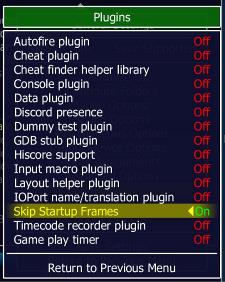

# :star: MAME Skip Startup Frames Plugin :star:

This is a LUA Plugin for [MAME](https://www.mamedev.org/) that automatically :arrow_right: skips the startup frames for roms when you start them.

## What does it do?

The plugin temporarily unthrottles :fast_forward: the framerate of a game at startup until a certain number of frames has been reached and then returns the framerate back to normal. The plugin also temporarily mutes :mute: the audio and blacks out the screen. The faster the computer :computer: the faster the unthrottled startup time will be.

## :video_game: `galaga` startup example

| Before: ~12 sec startup time               | After: ~1 sec startup time              |
| ------------------------------------------ | --------------------------------------- |
|  |  |

## Installation instructions

1. :arrow_down_small: Download `skipstartupframes.zip` from the [latest release](https://github.com/Jakobud/skipstartupframes/releases)
2. :open_file_folder: Unzip the file into the MAME `plugins` directory
   - Example: `c:\mame\plugins\skipstartupframes\`
3. :point_right: Enable the plugin in one of the following ways:

   - Enable `Skip Startup Frames` in MAME's Plugin Menu (Restarting MAME may be required)
   - Add `skipstartupframes` to the `plugin` option in `mame.ini`
   - Enable `skipstartupframes` in `plugin.ini`
   - Run MAME with the command-line option `-plugin skipstartupframes`

   

## :heavy_check_mark: Requirements

This plugin is compatibile with:

- **MAME 0.253** or newer
- **Arcade64 0.253** or newer

## :no_entry_sign: VSync Limitations

The plugin will not accurately skip frames when Vsync is enabled.

## :question: How does it work?

Every rom has a different startup procedure and different number of startup frames that need to be skipped. The included file `ssf.txt` defines how many frames should be skipped for each rom.

For more information on `ssf.txt` see the [SSF.TXT documentation](SSF.TXT.md).

## :calendar: 2004 BYOAC Legacy

Skip Startup Frames is not a new concept and not my idea. It was originally a MAME C++ patch that originated back in [early 2004](https://www.retroblast.com/archives/a-200403.html) by Alan Kamrowski II. It made it's way into some long-forgotten forks of MAME like NoNameMAME and BuddaMAME but has now been reborn as an easy-to-install MAME Plugin.

`ssf.txt` is a file that was [created back in 2004](https://forum.arcadecontrols.com/index.php/topic,48674.msg) and was the culmination of work by many dedicated members of the [Build Your Own Arcade Controls forum](https://forum.arcadecontrols.com/) who examined 1000's of games and recorded the correct number of frames to be skipped.

## :pencil: Options

| In-Game Plugin Options Menu               |                                                               |
| ----------------------------------------- | ------------------------------------------------------------- |
|  |  |

- `Black out screen during startup` - _Yes/No_

  - Whether or not to black out the screen while skipping startup frames.
  - The plugin still renders the startup frames. This option simply turns the screen black during the frame skipping. Turn this option off if you want to see the unthrottled startup frames.
  - Default: `Yes`

- `Mute audio during startup` - _Yes/No_

  - Whether or not to mute the audio while skipping startup frames.
  - Default: `Yes`

- `Fallback to parent rom frames` - _Yes/No_

  - If a rom is a clone and is not found in `ssf.txt`, fallback to using the parent rom's startup frames (if they exist) in `ssf.txt`.
  - Default: `Yes`

- `Debug Mode` - _Yes/No_

  - Enable debug mode to show frame numbers in game in order to help determine accurate startup frame values to use for roms.
  - A soft reset will be required to enable debug mode. Once enabled, debug mode can be toggled on/off.
  - Default: `No`

- `Slow Motion during Debug Mode` - _Yes/No_

  - Used to slowdown game speed/playback while in debug mode.
  - Can be toggled on/off during debug mode.
  - Default: `No`

- `Normal startup frames` - _Frame Number_

  - Frames to skip for the current game during a normal startup or hard reset
  - If edited, this value will be saved to `ssf_custom.txt`

- `Use alternate frames for a soft reset` - _Yes/No_

  - Whether or not to skip a different number of frames when a soft reset occurs
  - Some games have different startup procedures when a soft reset occurs

- `Soft reset frames` - _Frame Number_

  - Frames to skip for the current game when a soft reset occurs
  - If edited, this value will be saved to `ssf_custom.txt`

## :desktop_computer: Debug Mode

If you wish to adjust the number of startup frames to be skipped for a game, there is a "debug mode" that will facilitate determining accurate frame numbers. It displays the frame numbers on the screen and can optionally set the game in slow-motion.

See the **Options section** for more details.

## :page_facing_up: License

This project is licensed under the MIT License. See the [LICENSE](LICENSE) file for details.
